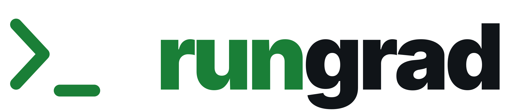

<picture>
  <source media="(prefers-color-scheme: dark)" srcset="docs/assets/rungrad-logo-dark.svg">
  
</picture>

rungrad is a Go framework for CLIs used in terminals, scripts, and CI. Each
command has text output for people, stable `--json` for programs, `--dry-run`
before changes, confirmation before destructive actions, stable exit codes, and
help text with examples. rungrad handles the shared CLI behavior.

The repo contains three parts:

- a Cobra-based Go framework for CLIs
- a `rungrad` binary that creates starter projects and scores CLIs
- a spec in [`spec/`](spec/README.md)

The spec stands on its own: a CLI written in any language can follow it and be
checked with `rungrad score`.

## Install

Requires Go 1.22.2 or newer.

```bash
go install github.com/vincentsch/rungrad/cmd/rungrad@v0.2.1
```

Add the framework to a Go module:

```bash
go get github.com/vincentsch/rungrad@v0.2.1
```

## Create a CLI

```bash
rungrad new mytool
cd mytool

go mod tidy
go test ./...
```

The generated project is a `widget` CLI. It has a list command, a create
command, a delete command that requires confirmation, an offline `update
--check`, tests, a README, and a hidden `__rungrad_manifest` command. Replace
the widget code with your own API or data.

Try the same command as text and as JSON:

```bash
go run . widget list
go run . widget list --json
```

Preview a change:

```bash
go run . widget create gamma --dry-run
go run . widget delete alpha --dry-run
```

The create command shows the request it would make and masks the secret field:

```text
DRY RUN: would POST /widgets
  body:
    name = gamma
    token = ***
  no changes were made
```

Your command handles the tool-specific work. rungrad handles output mode,
dry-run text, confirmation, redaction, help data, exit codes, docs helpers, and
scorer data.

## Score it

```bash
go build -o mytool .
rungrad score ./mytool \
  --read        "widget list" \
  --mutate      "widget create demo" \
  --destructive "widget delete alpha" \
  --update
```

The scorer reports pass, fail, or not-applicable for each rule in
`rungrad-spec/1`:

```text
Conformance against rungrad-spec/1
Overall: 100% weighted (15/15 applicable rules passed, 22 total rules)
  [PASS] dryrun.no-side-effects       --dry-run emitted a preview
  [n/a ] resolution.no-prompt         no ambiguous-resolution command configured
```

Each flag tells the scorer which command to use for that check. Commands you do
not provide are reported as not-applicable, not as failures. The starter covers
15 of the 22 rules. Auth, name resolution, and backend-error checks apply when
your tool has those features. Add `--json` for a JSON score and `--strict` to
fail CI when a required rule fails.

## What rungrad covers

- JSON and text output from the same command result.
- `--dry-run` previews for mutating commands.
- Confirmation before destructive actions.
- Stable exit codes for scripts and agents.
- Name-to-ID resolution that fails with candidates instead of prompting when
  non-interactive.
- Hidden manifest for tools that inspect a CLI.
- Helpers for generated command docs and help-output tests.
- A conformance scorer for any executable, including tools not written in Go.

## Use it in your own commands

A command returns its data plus a text renderer:

```go
&rungrad.Command{
    Use:         "list",
    Short:       "List widgets",
    Examples:    []string{"mytool widget list", "mytool widget list --json"},
    OutputModes: []string{rungrad.OutputModeHuman, rungrad.OutputModeJSON},
    Run: func(f *rungrad.Factory, cmd *cobra.Command, args []string) error {
        return f.WriteResult(widgets, func(w io.Writer) {
            // Render the human view here.
        })
    },
}
```

See [Building a CLI with rungrad](docs/building-a-cli.md) for the full framework
guide.

The reference CLI in [`cmd/rgref`](cmd/rgref/main.go) scores 100%; tests pin
that score.

## Docs

- [Getting started](docs/getting-started.md): install, scaffold a CLI, score a CLI
- [Building a CLI with rungrad](docs/building-a-cli.md): the framework guide for tool authors
- [Migrating from Cobra](docs/migrating-from-cobra.md): port an existing Cobra CLI without changing its public surface
- [Config and auth reference](docs/config-and-auth.md): profiles, auth files, services, and credential hooks
- [Machine manifest](docs/manifest.md): the hidden manifest protocol
- [Conformance and the spec](docs/conformance.md): the agent-ready spec and the scorer
- [CLI reference](docs/cli-reference.md): the `rungrad` command (`score`, `new`)

The written specification lives in [`spec/`](spec/README.md).

## Status

rungrad is pre-1.0. The spec version is `rungrad-spec/1`; the Go API may still
change before a stable 1.0 release.

## License

MIT
